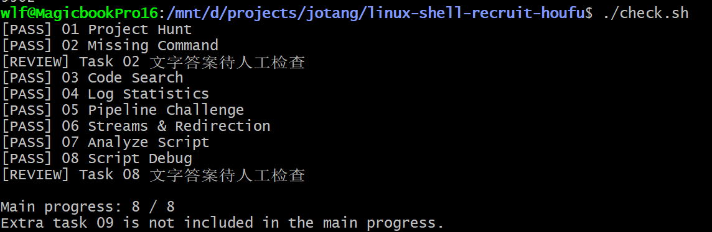
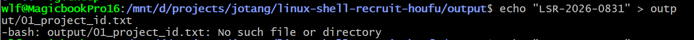

# 最终检查截图：

# Stage 0
1. Windows 的换行是`\r\n`，Linux 是`\n`，在VS Code右下角把`CRLF`改为`LF`即可。
2. 当从git仓库clone代码到本地时，`.sh`脚本文件默认只有读、写权限，没有执行权限； `chmod +x` 就是给文件增加可执行权限
3. `stdout`（标准输出）：输出程序正常运行结果 `stderr`（错误输出）：输出错误信息、警告

# Stage 1： Explore the Project
### Tak1：Project Hunt
1. `ls -a` 显示所有隐藏文件（.xxx）
2. `grep -r "PROJECT_ID" .` 在当前目录递归搜索
3. `>`覆盖写入(自动新建文件)；`>>` 是追加
4. 要清楚自己在什么位置，不应该在output目录下找output目录

### Tak2：Missing Command
1. `./tools/recruit-info` 在这种带路径的方式下，Shell不会去PATH搜索，会直接按照路径去找文件。 
而对于`recruit-info` 这种不带斜杠的裸命令，Shell会去PATH遍历寻找同名文件。 tools文件夹不在PATH里面，所以找不到，无法运行。
2. `ls` 中没有斜杠，所以Shell开始遍历PATH查找，找到匹配文件，检查有执行权限后就执行这个程序

# Stage 2：Search the Project
### Task3：Code Search
1. `grep -r -l -E 'TODO|FIXME' workspace/project/` `-l`：只输出匹配的文件名; 
 `-E 'TODO|FIXME'`：正则匹配，满足 TODO或者FIXME任意一个
 2. `|` 是Shell管道,意思是把前面命令的输出，当作后面命令的输入
 3. `sed 's|^\./||'`:删掉每行开头的 `./` 
 `s|A|B|`：替换，把 A 换成 B 
 `^`表示行开头；`^\./`：匹配**一行最前面**的 `./`
 4. `sort -u`：`-u` 去重，默认字典序排序

 ### Task4：Log Statistics
 1. `wc -l` 统计行数；`-w`：统计单词数；`-c`：统计字符数
 2. `sed -E 's/.*user=([^ ]*).*/\1/'`注意不要写成`[^]`
 3. `uniq`只对连续相同的行计数！所以前面必须先`sort`，把相同内容排到一起。
 4. `...| sort | uniq -c | sort -nr | awk 'NR==1{print$2}'`
 5. `cut -d'=' -f3`：  分隔符用“=”， 选第三段

# Stage 3：Connect the Tools
### Task5：Pipeline Challenge
### Task6 — Streams & Redirection
 1. `... > output/06_stdout.txt 2> output/06_stderr.txt` 
 `>` 等价 `1>`，重定向 stdout； `2>` 专门重定向 stderr
 2. `... | tee output/06_tee.txt` :把正常输出写入文件，所有输出打印到终端

# Stage 4： Automate the Work
### Task7 ： Analyze Script
1. vim编辑器：按键盘`i`进入编辑模式 -> 按`Esc`，输入 `:wq`回车退出
2. nano： `Ctrl+O`保存回车，`Ctrl+X`退出
3. code： 使用VS Code进行编辑
4. `[[ 条件 ]]` 是 Bash 内置的条件判断语法
5. `$#`：代表传入参数的数量。`$1`：脚本的第一个位置参数
6. `-eq`等于；`-ne`不等于；`-gt`大于；`-lt`小于；
7. `-f file`file 是普通文件，存在 `-d file`是文件夹 `-e file`文件 / 目录存在（不管类型） `-r file`文件可读br
8. `$(...)`执行括号里面的命令，把命令输出结果拿出来，替换掉`$(...)`这一整块文本。
9. `$?`上一条命令的退出状态码，非零表示失败。

### Task8:  Script Debug
1. `$var`:会触发单词分割（空格、换行、制表符）；再进行通配符展开（* ？） 
`$"var"`: 只做变量替换。
2. `for file in "$@"`：循环遍历剩下的所有参数
3. `cp "$file" "$destination/"`: 把文件复制到目标目录

# 附加题
### Task9: Process Hunter
1. `ps aux` ： 输出所有进程的一大段文本
2. `pgrep -f worker-beta`匹配完整命令字符串，防止只匹配进程名输出的数字就是PID
3. `kill xxxx`：正常终止进程； `kill -9 xxxx`：强制终止
4. 